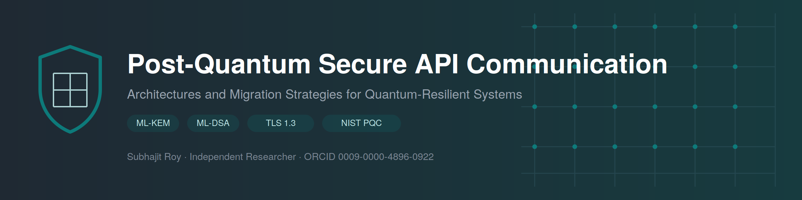
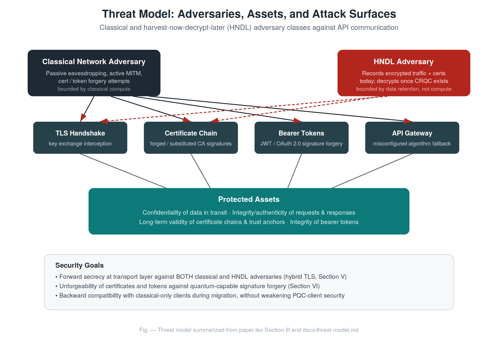
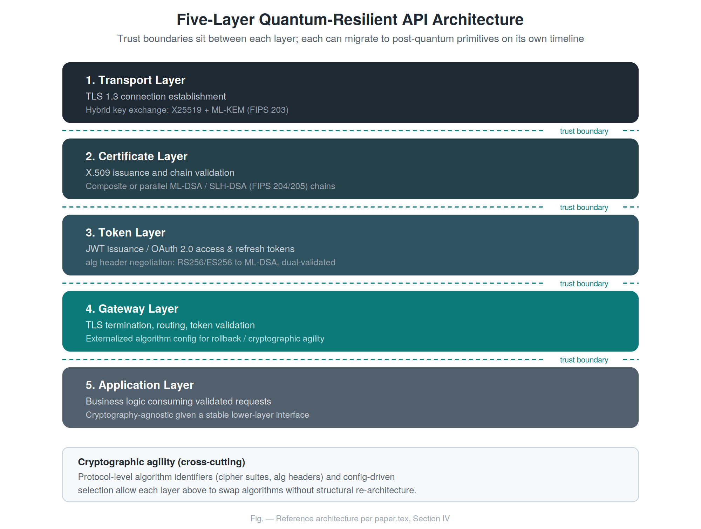
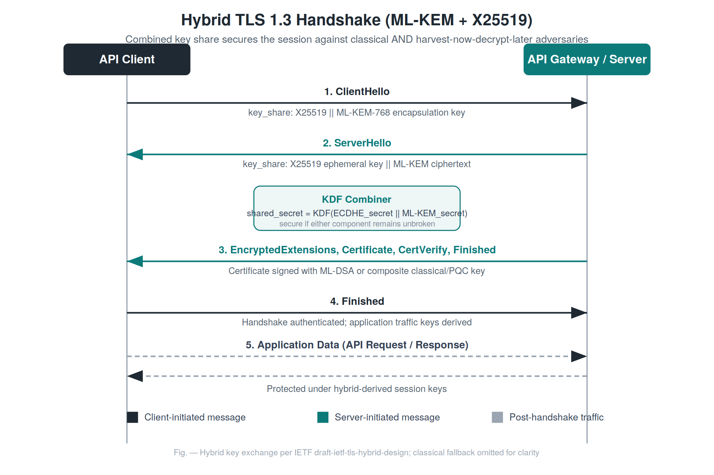
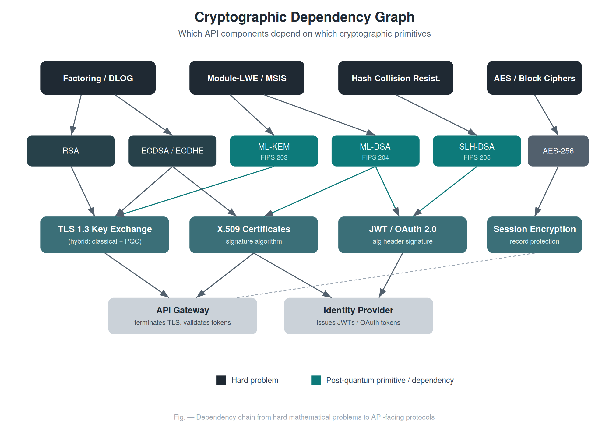

<div align="center">



# Post-Quantum Secure API Communication

### Architectures and Migration Strategies for Quantum-Resilient Systems

[](LICENSE)
[](https://doi.org/10.5281/zenodo.20413115)
[](https://zenodo.org/records/20413115)
[](https://orcid.org/0009-0000-4896-0922)
[](https://github.com/sr-857/post-quantum-api-security)
[](https://github.com/sr-857/post-quantum-api-security/commits/main)
[](CHANGELOG.md)
[](.github/workflows/build.yml)

**Author:** [Subhajit Roy](https://github.com/sr-857) · [ORCID](https://orcid.org/0009-0000-4896-0922) · [Google Scholar](https://scholar.google.com/citations?user=I3zt1eMAAAAJ) · [LinkedIn](https://www.linkedin.com/in/sr857)

</div>

---

## Overview

This repository hosts the research paper **"Post-Quantum Secure API
Communication: Architectures and Migration Strategies for
Quantum-Resilient Systems,"** along with its LaTeX source, supporting
diagrams, documentation, and a roadmap for future reproducible
implementation work.

The paper examines how API-mediated systems — TLS transport, X.509
certificate chains, JWT/OAuth 2.0 tokens, and API gateways — should be
re-architected to incorporate NIST-standardized post-quantum cryptographic
primitives (ML-KEM, ML-DSA, SLH-DSA) without disrupting availability or
backward compatibility during the transition.

## Abstract

> The advent of cryptographically relevant quantum computers threatens the
> asymmetric primitives — RSA, Diffie-Hellman, and elliptic-curve
> cryptography — that underpin the confidentiality and integrity of
> contemporary API communication. While large-scale quantum adversaries do
> not yet exist, the "harvest now, decrypt later" threat model means that
> data encrypted today under classical schemes may already be exposed to
> future cryptanalysis. This paper examines the practical migration of API
> security architectures toward post-quantum cryptography (PQC), focusing
> on the NIST-standardized algorithms ML-KEM (FIPS 203), ML-DSA (FIPS 204),
> and SLH-DSA (FIPS 205). We propose a layered reference architecture for
> quantum-resilient API systems, evaluate hybrid key-exchange strategies
> for TLS 1.3, and analyze the downstream effects of PQC adoption on
> certificate chains, JWT, OAuth 2.0 token issuance, and API gateway
> design. We further present a phased migration framework intended to
> guide practitioners through the transition without requiring a
> disruptive, single-step cutover.

Full text: [`paper/paper.pdf`](paper/paper.pdf) · LaTeX source: [`paper/paper.tex`](paper/paper.tex)

## Motivation

Shor's algorithm renders RSA and elliptic-curve cryptography insecure
against a sufficiently capable quantum computer. The timeline for such
hardware remains uncertain, but the asymmetry between attacker and
defender matters now: an adversary recording encrypted API traffic today
can decrypt it retroactively once quantum capability matures — the
**harvest-now, decrypt-later (HNDL)** threat. NIST finalized its first PQC
standards in 2024, which makes the migration question for production API
infrastructure an immediate, practical one rather than a purely
theoretical concern.

## Research Questions

| ID | Question |
|----|----------|
| RQ1 | What architectural layers of an API system are affected by the transition to post-quantum cryptography, and what are the trust boundaries between them? |
| RQ2 | How should hybrid key exchange be deployed in TLS 1.3 to provide quantum resistance while preserving compatibility with classical clients? |
| RQ3 | What changes are required in certificate chains, JWT issuance, and OAuth 2.0 flows to accommodate post-quantum signatures, and at what practical cost? |
| RQ4 | What migration sequencing minimizes operational risk while ensuring cryptographic agility for future algorithm transitions? |

## Key Contributions

- A **five-layer reference architecture** for quantum-resilient API systems (transport, certificate, token, gateway, application).
- A **threat model** covering both classical and harvest-now-decrypt-later adversaries against API communication.
- An analysis of **hybrid TLS 1.3 key exchange** (ML-KEM + ECDHE) following IETF hybrid key-exchange guidance.
- A **phased migration framework** spanning inventory, hybrid transport, certificate/token migration, and agility consolidation.
- A discussion of **cryptographic agility** as a first-class design requirement rather than an afterthought.

## Threat Model Summary

The paper considers two adversary classes: a **classical network
adversary** bounded by present-day computational limits, and an **HNDL
adversary** that records encrypted traffic and certificates today with the
intent of decrypting them once a cryptographically relevant quantum
computer exists. Protected assets include the confidentiality of data in
transit, the integrity/authenticity of requests and responses, the
long-term validity of certificate chains, and the integrity of bearer
tokens. Full details: [`docs/threat-model.md`](docs/threat-model.md).

<p align="center">
  
</p>

## System Architecture

The proposed architecture separates API security concerns into five
layers, each with its own migration timeline and trust boundary:

<p align="center">
  
</p>

Full details: [`docs/architecture.md`](docs/architecture.md).

## Hybrid TLS Overview

Hybrid key exchange combines a classical algorithm (X25519/ECDHE) with a
post-quantum KEM (ML-KEM) so that the session remains secure if *either*
component is unbroken. This hedges against both undiscovered weaknesses in
new PQC schemes and the eventual arrival of a quantum-capable adversary.

<p align="center">
  
</p>

## Cryptographic Agility

Algorithm substitution should not require re-architecture. This is
realized through protocol-level algorithm identifiers (TLS cipher suites,
JWT `alg` headers) and configuration-driven algorithm selection at the
gateway and identity-provider layers, rather than hard-coded assumptions
about key or signature sizes.

<p align="center">
  
</p>

## Migration Framework

A four-phase migration sequence prioritizes transport-layer protection
first (since HNDL exposure accrues continuously), with certificate and
token migration following on a coordinated but distinct timeline:

<p align="center">
  
</p>

Full details: [`docs/migration-guide.md`](docs/migration-guide.md).

## Repository Structure

```
post-quantum-api-security/
├── README.md                  This file
├── LICENSE                    MIT License
├── CITATION.cff                Citation metadata (GitHub "Cite this repository")
├── CODE_OF_CONDUCT.md          Community guidelines
├── CONTRIBUTING.md             Contribution guidelines
├── SECURITY.md                 Vulnerability reporting policy
├── CHANGELOG.md                Version history and research roadmap
│
├── paper/
│   ├── paper.pdf                Compiled research paper
│   ├── paper.tex                 LaTeX source (IEEE conference format)
│   ├── references.bib            BibTeX bibliography
│   ├── figures/                  Paper figures (reserved for future revisions)
│   └── supplementary/             Notation reference and supplementary notes
│
├── docs/
│   ├── architecture.md           Five-layer architecture details
│   ├── threat-model.md            Full threat model
│   ├── migration-guide.md         Step-by-step migration guidance
│   ├── bibliography.md            Annotated standards and references
│   └── faq.md                     Frequently asked questions
│
├── diagrams/                    SVG + PNG diagrams (architecture, handshake, etc.)
│
├── implementation/              Placeholder scope for future prototype work
│   ├── README.md
│   ├── examples/
│   ├── prototype/
│   └── benchmarks/
│
├── scripts/                     Build and bibliography helper scripts
│
└── assets/                      Logo, banner, and screenshots
```

## Installation

This repository's primary deliverable is the paper and its documentation;
no software installation is required to read it. To rebuild the paper
from source, you will need a TeX distribution with IEEEtran support:

```bash
# Debian/Ubuntu
sudo apt-get install texlive-latex-extra texlive-publishers texlive-bibtex-extra

# Verify
kpsewhich IEEEtran.cls
```

## Building the Paper

```bash
cd paper
xelatex paper.tex      # or: pdflatex paper.tex
bibtex paper
xelatex paper.tex
xelatex paper.tex
```

Or use the provided helper script:

```bash
./scripts/compile-latex.sh
```

## Reproducibility

This paper is a synthesis and architectural analysis; it does not yet
include original empirical benchmark data. The `implementation/`
directory reserves scope for prototype and benchmark work referenced in
the paper's Discussion and Conclusion sections (hybrid TLS handshake
latency, ML-KEM/ML-DSA performance under representative API workloads).
See [`CHANGELOG.md`](CHANGELOG.md) for the research roadmap governing
when this empirical work is expected to land.

## Citation

If you use this work, please cite:

```bibtex
@misc{roy2026postquantum,
  author       = {Subhajit Roy},
  title        = {Post-Quantum Secure API Communication: Architectures and Migration Strategies for Quantum-Resilient Systems},
  year         = {2026},
  publisher    = {Zenodo},
  doi          = {10.5281/zenodo.20413115},
  url          = {https://doi.org/10.5281/zenodo.20413115}
}
```

<details>
<summary><strong>Other citation formats (APA, IEEE, MLA, Chicago)</strong></summary>

**APA**

Roy, S. (2026). *Post-quantum secure API communication: Architectures and
migration strategies for quantum-resilient systems*. Zenodo.
https://doi.org/10.5281/zenodo.20413115

**IEEE**

S. Roy, "Post-quantum secure API communication: Architectures and
migration strategies for quantum-resilient systems," Zenodo, 2026, doi:
10.5281/zenodo.20413115.

**MLA**

Roy, Subhajit. *Post-Quantum Secure API Communication: Architectures and
Migration Strategies for Quantum-Resilient Systems*. Zenodo, 2026,
doi:10.5281/zenodo.20413115.

**Chicago**

Roy, Subhajit. 2026. "Post-Quantum Secure API Communication:
Architectures and Migration Strategies for Quantum-Resilient Systems."
Zenodo. https://doi.org/10.5281/zenodo.20413115.

</details>

Machine-readable citation metadata is also available in
[`CITATION.cff`](CITATION.cff) and via GitHub's "Cite this repository"
button.

## Research Links

| Resource | Link |
|---|---|
| 📄 Zenodo DOI | https://doi.org/10.5281/zenodo.20413115 |
| 📚 Zenodo Record | https://zenodo.org/records/20413115 |
| 🆔 ORCID | https://orcid.org/0009-0000-4896-0922 |
| 💻 GitHub Profile | https://github.com/sr-857 |
| 🎓 Google Scholar | https://scholar.google.com/citations?user=I3zt1eMAAAAJ |
| 💼 LinkedIn | https://www.linkedin.com/in/sr857 |

## License

This project is licensed under the [MIT License](LICENSE). The paper text
and diagrams are made available for reuse with attribution per the
citation above; code in `implementation/` (once populated) is licensed
under the same MIT terms unless otherwise noted in that subdirectory.

## Contact

**Subhajit Roy** — Independent Researcher
📧 subhajitroy857@gmail.com
🆔 [ORCID: 0009-0000-4896-0922](https://orcid.org/0009-0000-4896-0922)

For questions about the research, open a
[GitHub Discussion](https://github.com/sr-857/post-quantum-api-security/discussions)
or an issue. For security disclosures, see [`SECURITY.md`](SECURITY.md).

## Acknowledgements

The author thanks the maintainers of the [Open Quantum Safe
project](https://openquantumsafe.org) for their continued work providing
accessible reference implementations of NIST post-quantum algorithms, and
the NIST PQC standardization team for their multi-year public
standardization effort.

## Disclaimer

This repository is a research and documentation project produced by an
independent researcher. It is not affiliated with, endorsed by, or
representative of NIST, IETF, or any standards body referenced herein.
Content reflects the author's analysis and synthesis of publicly
available standards and literature at the time of writing and should not
be treated as formal security guidance for production deployments without
independent review.

## Future Work Roadmap

See [`CHANGELOG.md`](CHANGELOG.md) for the full versioned roadmap,
including planned prototype implementation, benchmark studies, and
conference/journal submission milestones.

---

<div align="center">

If this research is useful to you, consider starring the repository ⭐

</div>
