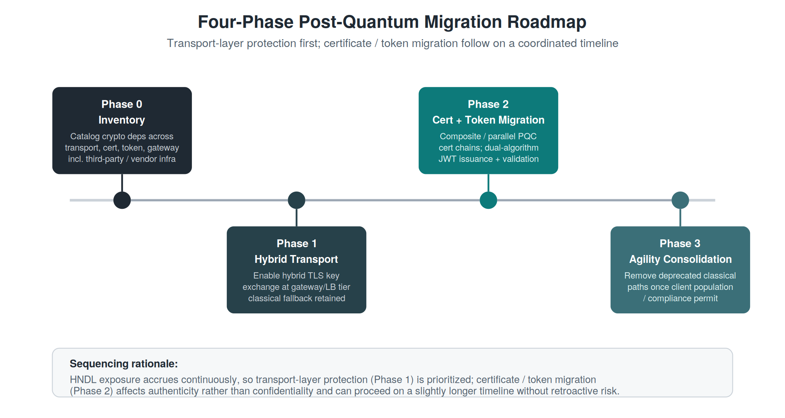

# Migration Guide

This guide expands on the four-phase migration framework proposed in
Section VII of the paper, with practical guidance for each of the five
sub-migrations referenced throughout: classical → hybrid TLS, ML-KEM
adoption, certificate migration, JWT migration, and API gateway
migration.

  

## Before You Start: Phase 0 — Inventory

Before any code or configuration changes, catalog every cryptographic
dependency across your API surface:

- **Transport layer**: which TLS libraries and versions are in use, at
  every termination point (load balancers, API gateways, service mesh
  sidecars, individual services that terminate TLS directly)?
- **Certificate layer**: which certificate authorities issue your
  certificates — internal, public commercial CA, or a managed service
  (e.g., a cloud provider's certificate manager)? What signature
  algorithm do they currently use, and do they have a published
  post-quantum roadmap?
- **Token layer**: which identity provider issues your JWTs/OAuth
  tokens? What signing algorithm is configured? Are there hard-coded
  assumptions about token size anywhere downstream (header size limits,
  fixed-size buffers, logging truncation)?
- **Gateway layer**: which gateway or reverse proxy product is in use,
  and does its TLS library support hybrid key-exchange groups?

This inventory step is the most commonly skipped phase in practice, and
the most consequential to skip — third-party and vendor-managed
infrastructure not under direct organizational control is often the
long-pole item in a realistic migration timeline.

## Classical → Hybrid TLS

**Goal:** Enable hybrid key exchange (classical + ML-KEM) at TLS
termination points, while preserving classical-only fallback for clients
that do not yet support hybrid groups.

**Steps:**

1. Confirm your TLS library/provider supports hybrid key-exchange groups
   (e.g., `X25519MLKEM768` or equivalent, following IETF
   `draft-ietf-tls-hybrid-design` naming conventions current at the time
   of writing).
2. Enable the hybrid group **alongside**, not instead of, existing
   classical groups in your TLS configuration. This preserves
   interoperability during the transition.
3. Monitor handshake telemetry to track the proportion of clients
   successfully negotiating the hybrid group versus falling back to
   classical-only.
4. Once client-side adoption is sufficiently mature (a threshold specific
   to your risk tolerance and compliance requirements), consider
   gateway-layer policy to require a minimum acceptable key-exchange
   group for sensitive endpoints.

**Engineering cost to anticipate:** Increased `ClientHello`/`ServerHello`
size (roughly 1.1–1.2 KB additional for ML-KEM-768 key shares versus 32
bytes for X25519). For most pooled-connection API workloads this is a
one-time, amortized cost; latency-sensitive connection-per-request
architectures should weight this more heavily.

## ML-KEM Migration Specifics

ML-KEM (FIPS 203) is the key-encapsulation mechanism underlying the
post-quantum component of hybrid TLS. Three parameter sets are defined:
ML-KEM-512, ML-KEM-768, and ML-KEM-1024, corresponding to increasing
security categories. ML-KEM-768 is the most commonly recommended default
for general-purpose TLS deployment, balancing security margin against key
size; ML-KEM-1024 may be appropriate for especially long-lived
confidentiality requirements.

## Certificate Migration

**Goal:** Migrate X.509 certificate chains to post-quantum or
composite-key signature algorithms without breaking relying-party
validation.

**Two approaches:**

1. **Sequential parallel chains** — issue a new post-quantum-signed
   chain alongside the existing classical chain. Relying parties without
   post-quantum support continue validating the classical chain; those
   with support can validate either. Lower implementation complexity,
   higher operational overhead (two chains to manage, rotate, and
   monitor).
2. **Composite certificates** — a single certificate embeds both a
   classical and a post-quantum public key and signature, per evolving
   IETF LAMPS working group drafts. Lower long-term operational overhead,
   but requires relying-party software capable of parsing the composite
   structure — check your TLS library's roadmap before committing to this
   path, as standardization and library support were still maturing at
   the time of writing.

**Practical note:** Certificate authority migration is frequently
**outside** your direct control if you rely on a commercial CA or a cloud
provider's managed certificate service. Track your CA's published
post-quantum roadmap as part of Phase 0 inventory.

## JWT Migration

**Goal:** Migrate JWT/OAuth 2.0 token signing to post-quantum signature
algorithms (ML-DSA or SLH-DSA) without breaking token validation for
services not yet updated.

**Steps:**

1. Confirm your identity provider's JWT library supports an ML-DSA or
   SLH-DSA `alg` identifier (library support varies; verify before
   committing to a timeline).
2. Begin issuing post-quantum-signed tokens for a subset of traffic
   (e.g., internal service-to-service tokens before customer-facing
   tokens), while resource servers retain the capacity to validate both
   classical (RS256/ES256) and post-quantum signatures.
3. **Check downstream size assumptions before rollout.** ML-DSA-44
   signatures (~2.4 KB) are roughly 30-40x larger than ECDSA P-256
   signatures (64-72 bytes). This has concrete implications:
   - HTTP header size limits (`Authorization: Bearer <token>`) — verify
     your gateway/load balancer's configured maximum header size
     accommodates the larger token.
   - Logging and observability pipelines that previously assumed
     short, fixed-size token fields.
   - Mobile or embedded clients with constrained request size limits.
4. Once validated, retire classical-only signing for new tokens, while
   continuing to accept previously-issued classical tokens until they
   naturally expire.

## API Gateway Migration

**Goal:** Coordinate the above three migrations at the convergence point
— the API gateway — without requiring a single atomic cutover.

**Checklist:**

- [ ] Hybrid TLS key-exchange groups enabled (see above)
- [ ] Gateway trusts both classical and post-quantum/composite
      certificate chains, as applicable to your certificate migration
      approach
- [ ] Gateway validates tokens signed under either classical or
      post-quantum algorithms during the transition window
- [ ] Algorithm configuration (allow-lists, minimum acceptable groups) is
      externalized to configuration, not hard-coded, to support rollback
- [ ] Monitoring/alerting in place to detect unexpected fallback to
      weaker algorithms in production
- [ ] Internal (gateway-to-service) connections inventoried separately —
      these may remain classical-only longer than the external-facing
      perimeter without immediate HNDL exposure, provided the internal
      network itself is not assumed to be adversary-observable

## Sequencing Rationale

The framework prioritizes **transport-layer migration first** because
harvest-now-decrypt-later exposure accrues continuously from the present
moment — every day of classical-only key exchange is a day of traffic
potentially exposed to future decryption. Certificate and token migration
affect **authenticity** rather than **confidentiality**, and a forged
signature requires the adversary to act in real time against a
currently-valid artifact; this is not retroactively exploitable in the
same way, and so can proceed on a coordinated but slightly longer
timeline without retroactive risk accumulation.

## Phase 3 — Agility Consolidation

Once client population and compliance requirements permit, remove
deprecated classical-only code paths — but retain the configuration-level
agility infrastructure built during Phases 1–2. Future algorithm
transitions (e.g., should a currently-standardized algorithm later be
deprecated) should not require repeating this entire migration from
scratch.
